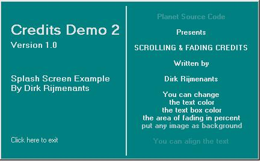



## \[ Scrolling and Fading Credits \]

### Description

Well, It's all in the title! The text is fading in and out. Smooth scrolling, no flicker. Left, center or right alignment. Very simple and compact code. No API's used, just plain and simple basic drawing code. Only two subs: Form_Load & Timer1_timer. You can change background, forecolor or even add your own image as background! There are 2 different demo forms to try out. (don't mind the screenshot, it's a bit fuzzy due to jpg conversion) All comments welcome ;-)
 
### More Info
 

             |
---                |---
**Submitted On**   |2005-02-06 19:05:36
**By**             |[D\. Rijmenants](https://github.com/Planet-Source-Code/PSCIndex/blob/master/ByAuthor/d-rijmenants.md)
**Level**          |Beginner
**User Rating**    |4.7 (93 globes from 20 users)
**Compatibility**  |VB 5\.0, VB 6\.0
**Category**       |[Graphics](https://github.com/Planet-Source-Code/PSCIndex/blob/master/ByCategory/graphics__1-46.md)
**World**          |[Visual Basic](https://github.com/Planet-Source-Code/PSCIndex/blob/master/ByWorld/visual-basic.md)
**Archive File**   |[\[\_Scrollin184968272005\.zip](https://github.com/Planet-Source-Code/d-rijmenants-scrolling-and-fading-credits__1-58729/archive/master.zip)

